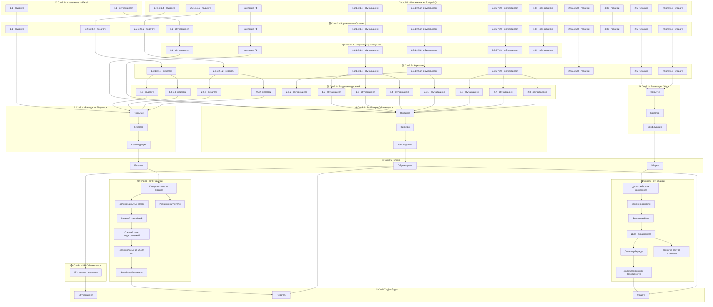
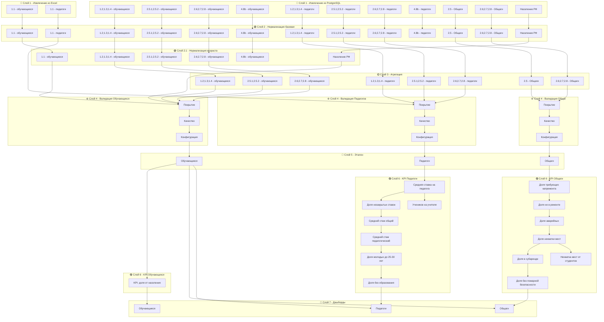

```mermaid
flowchart TB
    %% ===== СЛОЙ 1: ИЗВЛЕЧЕНИЕ =====
    subgraph L1_EX["🔵 Слой 1 - Извлечение из Excel"]
        S_Excel["1.1 - обучающиеся"]
        T_Excel["1.1 - педагоги"]
    end
    
    subgraph L1_PG["🔵 Слой 1 - Извлечение из PostgreSQL"]
        S_PG1["1.2;1.3;1.4 - обучающиеся"]
        S_PG2["2.5.1;2.5.2 - обучающиеся"]
        S_PG3["2.6;2.7;2.8 - обучающиеся"]
        S_PG4["4.8b - обучающиеся"]
        
        T_PG1["1.2;1.3;1.4 - педагоги"]
        T_PG2["2.5.1;2.5.2 - педагоги"]
        T_PG3["2.6;2.7;2.8 - педагоги"]
        T_PG4["4.8b - педагоги"]
        
        D_PG1["2.5 - Общаги"]
        D_PG2["2.6;2.7;2.8 - Общаги"]
        
        Pop_Source["Население РФ"]
    end

    %% ===== СЛОЙ 2: НОРМАЛИЗАЦИЯ =====
    subgraph L2_BASE["🟢 Слой 2 - Нормализация базовая"]
        S_Norm1["1.1 - обучающиеся"]
        S_Norm2["1.2;1.3;1.4 - обучающиеся"]
        S_Norm3["2.5.1;2.5.2 - обучающиеся"]
        S_Norm4["2.6;2.7;2.8 - обучающиеся"]
        S_Norm5["4.8b - обучающиеся"]
        Pop_Norm["Население РФ"]
        
        T_Norm1["1.1 - педагоги"]
        T_Norm2["1.2;1.3;1.4 - педагоги"]
        T_Norm3["2.5.1;2.5.2 - педагоги"]
        T_Norm4["2.6;2.7;2.8 - педагоги"]
        T_Norm5["4.8b - педагоги"]
        
        D_Norm1["2.5 - Общаги"]
        D_Norm2["2.6;2.7;2.8 - Общаги"]
    end
    
    subgraph L2_AGE["🟢 Слой 2.1 - Нормализация возраста"]
        Pop_Age["Население РФ"]
        S_Age1["1.1 - обучающиеся"]
        S_Age2["1.2;1.3;1.4 - обучающиеся"]
        S_Age3["2.5.1;2.5.2 - обучающиеся"]
        S_Age4["2.6;2.7;2.8 - обучающиеся"]
        S_Age5["4.8b - обучающиеся"]
    end

    %% ===== СЛОЙ 3: АГРЕГАЦИЯ =====
    subgraph L3_AGG["🟡 Слой 3 - Агрегация"]
        S_Agg1["1.2;1.3;1.4 - обучающиеся"]
        S_Agg2["2.5.1;2.5.2 - обучающиеся"]
        S_Agg3["2.6;2.7;2.8 - обучающиеся"]
        
        T_Agg1["1.2;1.3;1.4 - педагоги"]
        T_Agg2["2.5.1;2.5.2 - педагоги"]
        T_Agg3["2.6;2.7;2.8 - педагоги"]
        
        D_Agg1["2.5 - Общаги"]
        D_Agg2["2.6;2.7;2.8 - Общаги"]
    end
    
    subgraph L3_SEP["🟡 Слой 3 - Разделение уровней"]
        S_Sep1["1.2 - обучающиеся"]
        S_Sep2["1.3 - обучающиеся"]
        S_Sep3["1.4 - обучающиеся"]
        S_Sep4["2.5.1 - обучающиеся"]
        S_Sep5["2.5.2 - обучающиеся"]
        S_Sep6["2.6 - обучающиеся"]
        S_Sep7["2.7 - обучающиеся"]
        S_Sep8["2.8 - обучающиеся"]
        
        T_Sep1["1.2 - педагоги"]
        T_Sep2["1.3;1.4 - педагоги"]
        T_Sep3["2.5.1 - педагоги"]
        T_Sep4["2.5.2 - педагоги"]
    end

    %% ===== СЛОЙ 4: ВАЛИДАЦИЯ =====
    subgraph L4_VAL_STUD["⚙️ Слой 4 - Валидация Обучающихся"]
        Val_S_Cov["Покрытие"]
        Val_S_Qual["Качество"]
        Val_S_Conf["Конфигурация"]
    end
    
    subgraph L4_VAL_DORM["⚙️ Слой 4 - Валидация Общаг"]
        Val_D_Cov["Покрытие"]
        Val_D_Qual["Качество"]
        Val_D_Conf["Конфигурация"]
    end
    
    subgraph L4_VAL_PED["⚙️ Слой 4 - Валидация Педагогов"]
        Val_T_Cov["Покрытие"]
        Val_T_Qual["Качество"]
        Val_T_Conf["Конфигурация"]
    end

    %% ===== СЛОЙ 5: ЭТАЛОНЫ =====
    subgraph L5_ETL["🔴 Слой 5 - Эталон"]
        Etalon_S["Обучающиеся"]
        Etalon_T["Педагоги"]
        Etalon_D["Общаги"]
    end

    %% ===== СЛОЙ 6: РАСЧЕТ МЕТРИК =====
    subgraph L6_STUD["🟣 Слой 6 - KPI Обучающихся"]
        KPI_S["KPI: доля от населения"]
    end
    
    subgraph L6_PED["🟣 Слой 6 - KPI Педагоги"]
        KPI_T1["Средняя ставка на педагога"]
        KPI_T2["Доля незакрытых ставок"]
        KPI_T3["Средний стаж общий"]
        KPI_T4["Средний стаж педагогический"]
        KPI_T5["Доля молодых до 25-30 лет"]
        KPI_T6["Доля без образования"]
        KPI_T7["Учеников на учителя"]
    end
    
    subgraph L6_DORM["🟣 Слой 6 - KPI Общаги"]
        KPI_D1["Доля требующих капремонта"]
        KPI_D2["Доля не в ремонте"]
        KPI_D3["Доля аварийных"]
        KPI_D4["Доля нехватки мест"]
        KPI_D5["Доля в субаренде"]
        KPI_D6["Доля без пожарной безопасности"]
        KPI_D7["Нехватка мест от студентов"]
    end

    %% ===== СЛОЙ 7: ДАШБОРДЫ =====
    subgraph L7_DASH["🎨 Слой 7 - Дашборды"]
        Dashboard_S["Обучающиеся"]
        Dashboard_T["Педагоги"]
        Dashboard_D["Общаги"]
    end

    %% ===== ПОТОКИ ДАННЫХ: ОБУЧАЮЩИЕСЯ =====
    S_Excel --> S_Norm1
    S_PG1 --> S_Norm2
    S_PG2 --> S_Norm3
    S_PG3 --> S_Norm4
    S_PG4 --> S_Norm5
    Pop_Source --> Pop_Norm
    
    S_Norm1 --> S_Age1
    S_Norm2 --> S_Age2
    S_Norm3 --> S_Age3
    S_Norm4 --> S_Age4
    S_Norm5 --> S_Age5
    Pop_Norm --> Pop_Age
    
    S_Age2 --> S_Agg1
    S_Age3 --> S_Agg2
    S_Age4 --> S_Agg3
    
    S_Agg1 --> S_Sep1 & S_Sep2 & S_Sep3
    S_Agg2 --> S_Sep4 & S_Sep5
    S_Agg3 --> S_Sep6 & S_Sep7 & S_Sep8
    
    S_Age1 --> Val_S_Cov
    Pop_Age --> Val_S_Cov
    S_Sep1 --> Val_S_Cov
    S_Sep2 --> Val_S_Cov
    S_Sep3 --> Val_S_Cov
    S_Sep4 --> Val_S_Cov
    S_Sep6 --> Val_S_Cov
    S_Sep7 --> Val_S_Cov
    S_Sep8 --> Val_S_Cov
    
    Val_S_Cov --> Val_S_Qual --> Val_S_Conf

    %% ===== ПОТОКИ ДАННЫХ: ОБЩАГИ =====
    D_PG1 --> D_Norm1
    D_PG2 --> D_Norm2
    D_Norm1 --> D_Agg1
    D_Norm2 --> D_Agg2
    
    D_Agg1 --> Val_D_Cov
    D_Agg2 --> Val_D_Cov
    Val_D_Cov --> Val_D_Qual --> Val_D_Conf

    %% ===== ПОТОКИ ДАННЫХ: ПЕДАГОГИ =====
    T_Excel --> T_Norm1
    T_PG1 --> T_Norm2
    T_PG2 --> T_Norm3
    T_PG3 --> T_Norm4
    T_PG4 --> T_Norm5
    
    T_Norm2 --> T_Agg1
    T_Norm3 --> T_Agg2
    T_Norm4 --> T_Agg3
    
    T_Agg1 --> T_Sep1 & T_Sep2
    T_Agg2 --> T_Sep3 & T_Sep4
    
    T_Norm1 --> Val_T_Cov
    T_Sep1 --> Val_T_Cov
    T_Sep2 --> Val_T_Cov
    T_Sep3 --> Val_T_Cov
    T_Sep4 --> Val_T_Cov
    
    Val_T_Cov --> Val_T_Qual --> Val_T_Conf

    %% ===== ПОТОКИ К СЛОЮ 5 И 6 =====
    Val_S_Conf --> Etalon_S
    Val_D_Conf --> Etalon_D
    Val_T_Conf --> Etalon_T
    
    Etalon_S --> KPI_S
    Etalon_T --> KPI_T1
    Etalon_D --> KPI_D1
    
    KPI_T1 --> KPI_T2 & KPI_T7
    KPI_T2 --> KPI_T3
    KPI_T3 --> KPI_T4
    KPI_T4 --> KPI_T5
    KPI_T5 --> KPI_T6
    KPI_T6 --> Dashboard_T
    
    KPI_D1 --> KPI_D2
    KPI_D2 --> KPI_D3
    KPI_D3 --> KPI_D4
    KPI_D4 --> KPI_D5 & KPI_D7
    KPI_D5 --> KPI_D6
    KPI_D6 --> Dashboard_D
    
    KPI_S --> Dashboard_S
    
    Etalon_S --> Dashboard_D
    Etalon_S --> Dashboard_T

```

```mermaid
flowchart TB
    %% ===== СЛОЙ 1: ИЗВЛЕЧЕНИЕ =====
    subgraph L1_EX["🔵 Слой 1 - Извлечение из Excel"]
        S_Excel["1.1 - обучающиеся"]
        T_Excel["1.1 - педагоги"]
    end
    
    subgraph L1_PG["🔵 Слой 1 - Извлечение из PostgreSQL"]
        S_PG1["1.2;1.3;1.4 - обучающиеся"]
        S_PG2["2.5.1;2.5.2 - обучающиеся"]
        S_PG3["2.6;2.7;2.8 - обучающиеся"]
        S_PG4["4.8b - обучающиеся"]
        
        T_PG1["1.2;1.3;1.4 - педагоги"]
        T_PG2["2.5.1;2.5.2 - педагоги"]
        T_PG3["2.6;2.7;2.8 - педагоги"]
        T_PG4["4.8b - педагоги"]
        
        D_PG1["2.5 - Общаги"]
        D_PG2["2.6;2.7;2.8 - Общаги"]
        
        Pop_Source["Население РФ"]
    end

    %% ===== СЛОЙ 2: НОРМАЛИЗАЦИЯ =====
    subgraph L2_BASE["🟢 Слой 2 - Нормализация базовая"]
        S_Norm1["1.1 - обучающиеся"]
        S_Norm2["1.2;1.3;1.4 - обучающиеся"]
        S_Norm3["2.5.1;2.5.2 - обучающиеся"]
        S_Norm4["2.6;2.7;2.8 - обучающиеся"]
        S_Norm5["4.8b - обучающиеся"]
        Pop_Norm["Население РФ"]
        
        T_Norm1["1.1 - педагоги"]
        T_Norm2["1.2;1.3;1.4 - педагоги"]
        T_Norm3["2.5.1;2.5.2 - педагоги"]
        T_Norm4["2.6;2.7;2.8 - педагоги"]
        T_Norm5["4.8b - педагоги"]
        
        D_Norm1["2.5 - Общаги"]
        D_Norm2["2.6;2.7;2.8 - Общаги"]
    end
    
    subgraph L2_AGE["🟢 Слой 2.1 - Нормализация возраста"]
        Pop_Age["Население РФ"]
        S_Age1["1.1 - обучающиеся"]
        S_Age2["1.2;1.3;1.4 - обучающиеся"]
        S_Age3["2.5.1;2.5.2 - обучающиеся"]
        S_Age4["2.6;2.7;2.8 - обучающиеся"]
        S_Age5["4.8b - обучающиеся"]
    end

    %% ===== СЛОЙ 3: АГРЕГАЦИЯ =====
    subgraph L3_AGG["🟡 Слой 3 - Агрегация"]
        S_Agg1["1.2;1.3;1.4 - обучающиеся"]
        S_Agg2["2.5.1;2.5.2 - обучающиеся"]
        S_Agg3["2.6;2.7;2.8 - обучающиеся"]
        
        T_Agg1["1.2;1.3;1.4 - педагоги"]
        T_Agg2["2.5.1;2.5.2 - педагоги"]
        T_Agg3["2.6;2.7;2.8 - педагоги"]
        
        D_Agg1["2.5 - Общаги"]
        D_Agg2["2.6;2.7;2.8 - Общаги"]
    end

    %% ===== СЛОЙ 4: ВАЛИДАЦИЯ =====
    subgraph L4_VAL_STUD["⚙️ Слой 4 - Валидация Обучающихся"]
        Val_S_Cov["Покрытие"]
        Val_S_Qual["Качество"]
        Val_S_Conf["Конфигурация"]
    end
    
    subgraph L4_VAL_DORM["⚙️ Слой 4 - Валидация Общаг"]
        Val_D_Cov["Покрытие"]
        Val_D_Qual["Качество"]
        Val_D_Conf["Конфигурация"]
    end
    
    subgraph L4_VAL_PED["⚙️ Слой 4 - Валидация Педагогов"]
        Val_T_Cov["Покрытие"]
        Val_T_Qual["Качество"]
        Val_T_Conf["Конфигурация"]
    end

    %% ===== СЛОЙ 5: ЭТАЛОНЫ =====
    subgraph L5_ETL["🔴 Слой 5 - Эталон"]
        Etalon_S["Обучающиеся"]
        Etalon_T["Педагоги"]
        Etalon_D["Общаги"]
    end

    %% ===== СЛОЙ 6: РАСЧЕТ МЕТРИК =====
    subgraph L6_STUD["🟣 Слой 6 - KPI Обучающихся"]
        KPI_S["KPI: доля от населения"]
    end
    
    subgraph L6_PED["🟣 Слой 6 - KPI Педагоги"]
        KPI_T1["Средняя ставка на педагога"]
        KPI_T2["Доля незакрытых ставок"]
        KPI_T3["Средний стаж общий"]
        KPI_T4["Средний стаж педагогический"]
        KPI_T5["Доля молодых до 25-30 лет"]
        KPI_T6["Доля без образования"]
        KPI_T7["Учеников на учителя"]
    end
    
    subgraph L6_DORM["🟣 Слой 6 - KPI Общаги"]
        KPI_D1["Доля требующих капремонта"]
        KPI_D2["Доля не в ремонте"]
        KPI_D3["Доля аварийных"]
        KPI_D4["Доля нехватки мест"]
        KPI_D5["Доля в субаренде"]
        KPI_D6["Доля без пожарной безопасности"]
        KPI_D7["Нехватка мест от студентов"]
    end

    %% ===== СЛОЙ 7: ДАШБОРДЫ =====
    subgraph L7_DASH["🎨 Слой 7 - Дашборды"]
        Dashboard_S["Обучающиеся"]
        Dashboard_T["Педагоги"]
        Dashboard_D["Общаги"]
    end

    %% ===== ПОТОКИ ДАННЫХ: ОБУЧАЮЩИЕСЯ =====
    S_Excel --> S_Norm1
    S_PG1 --> S_Norm2
    S_PG2 --> S_Norm3
    S_PG3 --> S_Norm4
    S_PG4 --> S_Norm5
    Pop_Source --> Pop_Norm
    
    S_Norm1 --> S_Age1
    S_Norm2 --> S_Age2
    S_Norm3 --> S_Age3
    S_Norm4 --> S_Age4
    S_Norm5 --> S_Age5
    Pop_Norm --> Pop_Age
    
    S_Age2 --> S_Agg1
    S_Age3 --> S_Agg2
    S_Age4 --> S_Agg3
    
    S_Age1 --> Val_S_Cov
    Pop_Age --> Val_S_Cov
    S_Agg1 --> Val_S_Cov
    S_Agg2 --> Val_S_Cov
    S_Agg3 --> Val_S_Cov
    
    Val_S_Cov --> Val_S_Qual --> Val_S_Conf

    %% ===== ПОТОКИ ДАННЫХ: ОБЩАГИ =====
    D_PG1 --> D_Norm1
    D_PG2 --> D_Norm2
    D_Norm1 --> D_Agg1
    D_Norm2 --> D_Agg2
    
    D_Agg1 --> Val_D_Cov
    D_Agg2 --> Val_D_Cov
    Val_D_Cov --> Val_D_Qual --> Val_D_Conf

    %% ===== ПОТОКИ ДАННЫХ: ПЕДАГОГИ =====
    T_Excel --> T_Norm1
    T_PG1 --> T_Norm2
    T_PG2 --> T_Norm3
    T_PG3 --> T_Norm4
    T_PG4 --> T_Norm5
    
    T_Norm2 --> T_Agg1
    T_Norm3 --> T_Agg2
    T_Norm4 --> T_Agg3
    
    T_Norm1 --> Val_T_Cov
    T_Agg1 --> Val_T_Cov
    T_Agg2 --> Val_T_Cov
    T_Agg3 --> Val_T_Cov
    
    Val_T_Cov --> Val_T_Qual --> Val_T_Conf

    %% ===== ПОТОКИ К СЛОЮ 5 И 6 =====
    Val_S_Conf --> Etalon_S
    Val_D_Conf --> Etalon_D
    Val_T_Conf --> Etalon_T
    
    Etalon_S --> KPI_S
    Etalon_T --> KPI_T1
    Etalon_D --> KPI_D1
    
    KPI_T1 --> KPI_T2 & KPI_T7
    KPI_T2 --> KPI_T3
    KPI_T3 --> KPI_T4
    KPI_T4 --> KPI_T5
    KPI_T5 --> KPI_T6
    KPI_T6 --> Dashboard_T
    
    KPI_D1 --> KPI_D2
    KPI_D2 --> KPI_D3
    KPI_D3 --> KPI_D4
    KPI_D4 --> KPI_D5 & KPI_D7
    KPI_D5 --> KPI_D6
    KPI_D6 --> Dashboard_D
    
    KPI_S --> Dashboard_S
    
    Etalon_S --> Dashboard_D
    Etalon_S --> Dashboard_T
```
